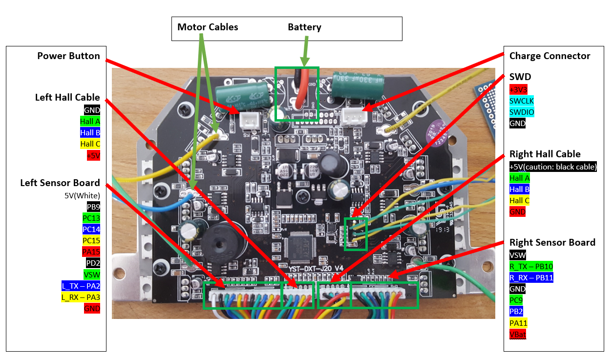

# HoverRun hoverboard firmware

This repo is cleaned up and rebuilt code from thanek's Hoverboard Hack Firmware for some of the newer (V5.1) mainboards with the AT32F413RCT7 controller. Original repo can be found here: https://github.com/thanek/hoverboard-firmware-hack

---

## Tools Installation Instructions

Use the below commands to install the ST-Link Tools:

```
sudo apt-get install cmake
sudo apt-get install libusb-1.0.0
git clone https://github.com/texane/stlink.git
cd stlink
make release
cd build/Release 
sudo make install
sudo ldconfig
```

Use the below commands to install OpenOCD:

```
git clone https://github.com/ntfreak/openocd.git
./bootstrap
./configure --enable-stlink
make
sudo make install
sudo ldconfig
```

---

## Build Instructions

The code was compiled with GNU arm-none-eabi-gcc 4.9.3 under ubuntu 16.04 and should be compilable with other versions of the arm-gcc.

To build, clone this repository and run make:

```
https://github.com/hwalli92/HoverRunFW.git
make
```

Only boards with the AT32F413RCT7 controller are supported.

---

## Hardware

Source: https://github.com/thanek/hoverboard-firmware-hack



---

## Flashing
To build the firmware, just type "make". Make sure you have specified your gcc-arm-none-eabi binary location in the Makefile ("PREFIX = ...") (version 7 works, there is a version that does not!) (if the ons in linux repos do not work, use the official version: https://developer.arm.com/open-source/gnu-toolchain/gnu-rm/downloads). 

Write to the STM32, there is a debugging header with 3V3, SWCLK, SWDIO and GND (pin 1). Connect GND, SWDIO and SWCLK to your SWD programmer, like the ST-Link found on many STM devboards. Do not power the mainboard from the 3.3V of your programmer!

Make sure you hold the powerbutton or connect a jumper to the power button pins while flashing the firmware, as the controller might release the power latch and switches itself off during flashing. Battery > 36V have to be connected while flashing.

I flashed my AT32 with a ST-Link using the SWD connector.

If you never flashed your mainboard before, the STM is probably locked. To unlock the flash, use the following OpenOCD command:

```
openocd -f interface/stlink.cfg -f target/stm32f3x.cfg -c init -c "reset halt" -c "stm32f2x unlock 0" -c "shutdown"
```

To program, use the following OpenOCD command:

```
openocd -f interface/stlink.cfg -f target/stm32f3x.cfg -c init -c "reset halt" -c "flash write_image erase build/hover.hex 0 ihex" -c "shutdown"
```

---

## Troubleshooting
First, check that power is connected and voltage is >36V while flashing.
If the board draws more than 100mA in idle, it's probably broken.

If the motors do something, but don't rotate smooth and quietly, try to use an alternative phase mapping. Usually, color-correct mapping (blue to blue, green to green, yellow to yellow) works fine. However, some hoverboards have a different layout then others, and this might be the reason your motor isn't spinning.

If using OpenOCD, you will probably encounter a problem with it not recognizing the AT32 as a STM32 ("Cannot identify target as a STM32 family"). You will need to modify and compile OpenOCD, like in https://github.com/bipropellant/bipropellant-hoverboard-firmware/issues/67#issuecomment-516657520, however:
- Use 0x240 instead of 0x242
- Use "max_flash_size_in_kb = 256;" instead of "max_flash_size_in_kb = 512;"
- Modify the debug message to say ATF32F413 instead of ATF32F403

---

## Uart Communication

You can connect to your hoverboard using UART3 to pins L_TX (PB10), L_RX (PB11) and GND on the left sensor board via RaspberryPI and use some simple commands:
* ping (you should receive "pong" as a response)
* status (you should receive basic diagnostic info like speed of motors, battery status, and so on. Response format is like "1:0 2:0 3:54 4:54 5:1491 ...")
* start (starts both motors with a speed of 100)
* move [steer] [speed] (sets motor speed and steering)
* stop (stops both motors)
* poweroff (shuts the hoverboard down)
You should terminate commands with ';' or new line characters.
